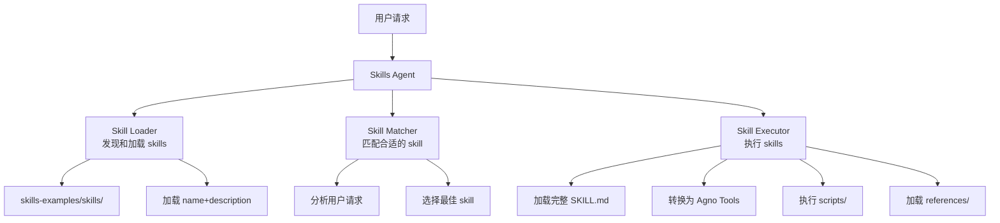

# Agno Skills Agent 实施计划

## 核心架构设计

基于 Agent Skills 规范和 Agno 框架，创建一个智能体系统，将 Skills 的能力映射到 Agno 的工具和知识库机制：



## 第一阶段：核心基础设施

### 1.1 项目结构设置

创建以下目录结构：

```
agno_skills/
├── agno_skills_agent/
│   ├── __init__.py
│   ├── skill_loader.py      # Skill 发现和加载
│   ├── skill_matcher.py     # Skill 匹配逻辑
│   ├── skill_executor.py    # Skill 执行引擎
│   └── skills_agent.py      # 主 Agent 类
├── examples/
│   ├── basic_usage.py       # 基础使用示例
│   └── create_skill.py      # 创建 skill 示例
├── requirements.txt
└── README.md
```

### 1.2 Skill Loader 实现

实现 [`agno_skills_agent/skill_loader.py`](agno_skills_agent/skill_loader.py)：

**功能**：

- 扫描 `skills-examples/skills/` 目录
- 解析每个 skill 的 `SKILL.md` frontmatter
- 提取 `name` 和 `description`（仅元数据，不加载完整内容）
- 返回 skill 目录映射

**关键类**：

```python
class SkillMetadata:
    name: str
    description: str
    path: Path
    license: Optional[str]
    
class SkillLoader:
    def discover_skills(self, skills_dir: Path) -> Dict[str, SkillMetadata]
    def load_full_skill(self, skill_name: str) -> SkillContent
```

**技术细节**：

- 使用 `yaml` 库解析 frontmatter
- 只读取 YAML 部分，不加载 Markdown body（渐进式披露）
- 缓存元数据以提高性能

### 1.3 Skill Executor 实现

实现 [`agno_skills_agent/skill_executor.py`](agno_skills_agent/skill_executor.py)：

**功能**：

- 将 skill 的 `scripts/` 转换为 Agno 可调用的 Python 函数
- 将 `references/` 内容作为知识库或上下文
- 处理 `assets/` 文件的访问

**关键方法**：

```python
class SkillExecutor:
    def load_skill_scripts(self, skill_path: Path) -> List[Callable]
    def load_skill_references(self, skill_path: Path) -> str
    def create_agno_tools(self, skill_name: str) -> List[Callable]
```

**技术细节**：

- 动态导入 Python 脚本为函数
- 为每个脚本创建包装函数，添加文档字符串
- 错误处理和日志记录

## 第二阶段：Skills Agent 核心

### 2.1 主 Agent 实现

实现 [`agno_skills_agent/skills_agent.py`](agno_skills_agent/skills_agent.py)：

**架构**：使用 Agno 的动态工具管理能力

```python
from agno.agent import Agent
from agno.models.openai import OpenAIChat

class SkillsAgent:
    def __init__(self, skills_dir: Path):
        # 1. 加载所有 skill 元数据
        self.skill_loader = SkillLoader()
        self.skills_metadata = self.skill_loader.discover_skills(skills_dir)
        
        # 2. 创建基础 Agno Agent
        self.agent = Agent(
            model=OpenAIChat(id="gpt-4o"),
            instructions=self._build_instructions(),
            markdown=True,
        )
        
        # 3. 添加 skill 匹配工具
        self._add_skill_selection_tool()
    
    def _build_instructions(self) -> str:
        # 将所有 skill 元数据添加到指令中
        # 格式：<available_skills>...</available_skills>
        
    def _add_skill_selection_tool(self):
        # 添加一个工具，让 agent 可以选择并激活 skill
        
    def activate_skill(self, skill_name: str):
        # 1. 加载完整的 SKILL.md
        # 2. 使用 SkillExecutor 创建工具
        # 3. 使用 agent.add_tool() 动态添加工具
```

**关键特性**：

- **渐进式披露**：初始只加载元数据（~100 tokens/skill），激活时加载完整内容
- **动态工具管理**：使用 Agno 的 `add_tool()` 和 `set_tools()` API
- **智能匹配**：Agent 根据用户请求和 skill 描述自动选择

### 2.2 Skill Matcher 实现

实现 [`agno_skills_agent/skill_matcher.py`](agno_skills_agent/skill_matcher.py)：

**功能**：

- 分析用户请求
- 计算与各个 skill 描述的相似度
- 返回最匹配的 skill（可选多个）

**实现方式**：

```python
class SkillMatcher:
    def match_skills(self, user_query: str, 
                     skills: Dict[str, SkillMetadata]) -> List[str]:
        # 方案1: 简单关键词匹配
        # 方案2: 使用 embedding 计算相似度
        # 方案3: 让 LLM 根据描述选择（推荐）
```

**推荐方案**：创建一个专门的工具函数，让主 Agent 调用来选择 skill

## 第三阶段：Skill 创建能力

### 3.1 集成 skill-creator

利用 [`skills-examples/skills/skill-creator/SKILL.md`](skills-examples/skills/skill-creator/SKILL.md) 中的指导：

**实现**：

- 将 skill-creator 作为一个特殊的 skill 加载
- 提供工具函数调用 `init_skill.py` 和 `package_skill.py`
- 实现交互式 skill 创建流程

### 3.2 Skill 管理工具

添加额外的管理工具：

```python
def list_available_skills() -> List[str]:
    """列出所有可用的 skills"""
    
def get_skill_info(skill_name: str) -> str:
    """获取 skill 的详细信息"""
    
def create_new_skill(name: str, description: str) -> str:
    """创建新的 skill（调用 init_skill.py）"""
    
def validate_skill(skill_path: str) -> str:
    """验证 skill 是否符合规范"""
```

## 第四阶段：示例和文档

### 4.1 基础使用示例

创建 [`examples/basic_usage.py`](examples/basic_usage.py)：

```python
from agno_skills_agent import SkillsAgent

# 初始化 agent
agent = SkillsAgent(skills_dir="skills-examples/skills")

# 使用示例1：自动匹配 skill
response = agent.run("帮我创建一个新的 MCP server")
# 应该自动激活 mcp-builder skill

# 使用示例2：测试 web 应用
response = agent.run("测试 localhost:3000 的登录功能")
# 应该自动激活 webapp-testing skill

# 使用示例3：创建新 skill
response = agent.run("帮我创建一个处理 CSV 文件的 skill")
# 应该激活 skill-creator skill
```

### 4.2 创建 skill 示例

创建 [`examples/create_skill.py`](examples/create_skill.py)：演示如何使用 agent 创建新 skill

### 4.3 文档

创建 [`README.md`](README.md)：

- 项目介绍
- 快速开始
- 架构说明
- API 文档
- 示例链接

## 技术实现细节

### 依赖管理

[`requirements.txt`](requirements.txt)：

```
agno>=0.1.0
openai>=1.0.0
pyyaml>=6.0
pydantic>=2.0.0
```

### MCP Server 集成

在 agent 初始化时配置 MCP：

```python
# 使用提供的 MCP server 查询 Agno 文档
# 配置已在 .cursor 中：agno-docs @ https://docs.agno.com/mcp
```

### 错误处理

- Skill 加载失败：记录警告，跳过该 skill
- 脚本执行失败：返回错误信息给 agent
- 文件不存在：优雅降级

### 性能优化

- 元数据缓存：避免重复扫描
- 延迟加载：只在需要时加载完整 SKILL.md
- 脚本缓存：已导入的脚本不重复导入

## 测试策略

### 单元测试

- SkillLoader 的解析功能
- SkillExecutor 的工具转换
- SkillMatcher 的匹配逻辑

### 集成测试

- 完整的 skill 激活流程
- 多个 skill 协同工作
- 创建新 skill 的流程

### 手动测试

- 使用真实的 skills-examples
- 测试各种用户查询
- 验证渐进式披露机制

## 关键文件清单

1. [`agno_skills_agent/skill_loader.py`](agno_skills_agent/skill_loader.py) - Skill 发现和元数据加载
2. [`agno_skills_agent/skill_executor.py`](agno_skills_agent/skill_executor.py) - Skill 执行引擎
3. [`agno_skills_agent/skill_matcher.py`](agno_skills_agent/skill_matcher.py) - Skill 匹配逻辑
4. [`agno_skills_agent/skills_agent.py`](agno_skills_agent/skills_agent.py) - 主 Agent 类
5. [`examples/basic_usage.py`](examples/basic_usage.py) - 基础使用示例
6. [`examples/create_skill.py`](examples/create_skill.py) - 创建 skill 示例
7. [`requirements.txt`](requirements.txt) - Python 依赖
8. [`README.md`](README.md) - 项目文档

## 实施顺序

1. **第一步**：实现 SkillLoader（解析 frontmatter，发现 skills）
2. **第二步**：实现 SkillExecutor（脚本加载和工具转换）
3. **第三步**：实现基础 SkillsAgent（集成 Agno Agent）
4. **第四步**：添加 skill 匹配和激活逻辑
5. **第五步**：集成 skill-creator 功能
6. **第六步**：创建示例和文档
7. **第七步**：测试和优化