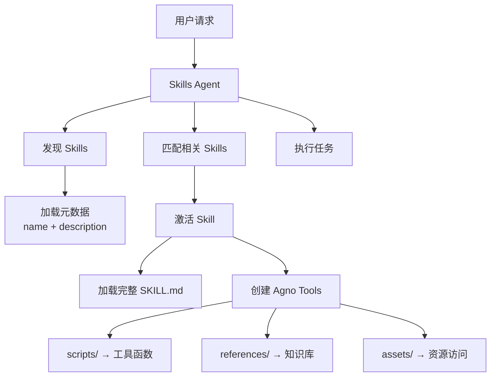

# Agno Skills Agent

🚀 **将 Anthropic Claude 的 Agent Skills 能力移植到 Agno 框架**

一个能够自动发现、匹配和执行 Agent Skills 的智能体系统。本项目基于 [Agno](https://docs.agno.com) 框架，实现了原本由 Anthropic Claude 提供的 [Agent Skills 规范](https://agentskills.io)，让任何 LLM（如阿里云通义千问）都能拥有模块化的专业技能管理能力。

### 💡 项目亮点

- **技能移植**：将 Anthropic 的 Agent Skills 理念带到 Agno 生态
- **框架无关**：不依赖 Claude，使用开源 Agno 框架 + DashScope（通义千问）
- **完全兼容**：遵循 Anthropic 的 Agent Skills 规范，可直接使用社区 Skills
- **中文优化**：针对中文场景优化，使用阿里云 DashScope API

## 特性

- **渐进式披露**：初始只加载 skill 元数据，激活时才加载完整内容，优化上下文使用
- **智能匹配**：根据用户请求自动匹配和激活相关的 skills
- **动态工具管理**：运行时动态添加 skill 工具到 agent
- **脚本执行**：自动将 skill 脚本转换为可调用的 Agno 工具
- **知识整合**：支持加载 skill 的 references 文档作为知识库
- **Skill 创建**：集成 skill-creator 功能，支持创建新的 skills

## 快速开始

### 1. 安装依赖

```bash
pip install -r requirements.txt
```

### 2. 获取 API 密钥

访问 [阿里云 DashScope 控制台](https://dashscope.console.aliyun.com/) 获取 API 密钥。

### 3. 设置 API 密钥

**方法 1 - 使用 .env 文件（推荐）：**

在项目根目录创建 `.env` 文件：
```env
DASHSCOPE_API_KEY=sk-your-dashscope-api-key
```

**方法 2 - 设置环境变量：**

Linux/macOS:
```bash
export DASHSCOPE_API_KEY="your-dashscope-api-key"
```

Windows PowerShell:
```powershell
$env:DASHSCOPE_API_KEY="your-dashscope-api-key"
```

Windows CMD:
```cmd
set DASHSCOPE_API_KEY=your-dashscope-api-key
```

### 4. 测试连接

```bash
python test_connection.py
```

**注意**：本项目已配置为使用**中国大陆 DashScope 端点**。如果你使用国际版 API，请参考 [端点配置文档](docs/dashscope_endpoints.md)。

### 基础使用

```python
from pathlib import Path
from agno_skills_agent import SkillsAgent

# 初始化 agent，指向 skills 目录
agent = SkillsAgent(
    skills_dir="skills-examples/skills",
    model_id="qwen-plus"
    # 注意：项目已配置中国大陆 DashScope 端点
)

# Agent 会自动发现、匹配和激活相关的 skills
agent.print_response("帮我创建一个新的 MCP server")
```

### 运行示例

```bash
# 基础使用示例
python examples/basic_usage.py

# Skill 创建示例
python examples/create_skill.py
```

## 架构说明

### 核心组件

```
agno_skills_agent/
├── skill_loader.py       # Skill 发现和元数据加载
├── skill_executor.py     # 脚本执行和工具转换
├── skill_matcher.py      # 智能 skill 匹配
├── skills_agent.py       # 主 Agent 类
└── skill_creator_tools.py # Skill 创建工具
```

### 工作流程



### 渐进式披露

Skills Agent 实现了三级渐进式披露机制：

1. **元数据阶段**（启动时）：只加载 `name` 和 `description`，每个 skill 约 100 tokens
2. **指令阶段**（激活时）：加载完整的 `SKILL.md` 内容和目录信息
3. **资源阶段**（按需）：根据需要加载 scripts、references 和 assets

这种设计确保了：
- 启动快速，context 占用最小
- 只在需要时加载详细内容
- 支持大量 skills 而不影响性能

## API 文档

### SkillsAgent

主要的 agent 类，集成所有功能。

```python
agent = SkillsAgent(
    skills_dir: str | Path,      # Skills 目录路径
    model_id: str = "qwen-plus", # DashScope 模型 ID
    api_key: Optional[str] = None, # API key（可选）
    debug: bool = False           # 调试模式
)
```

**方法**：

- `run(message: str) -> Any`：运行 agent 处理用户消息
- `print_response(message: str, stream: bool = True)`：打印 agent 响应
- `activate_skill(skill_name: str) -> str`：手动激活指定 skill
- `get_activated_skills() -> list[str]`：获取已激活的 skills
- `reload_skills()`：重新加载 skills 元数据

**内置工具**（agent 自动可用）：

- `activate_skill(skill_name)`: 激活一个 skill
- `list_skills()`: 列出所有可用 skills
- `get_skill_info(skill_name)`: 获取 skill 详细信息
- `suggest_skills(user_query)`: 为查询推荐 skills

### SkillLoader

负责发现和加载 skills。

```python
loader = SkillLoader()
skills = loader.discover_skills(Path("skills-examples/skills"))
full_content = loader.load_full_skill("mcp-builder")
```

### SkillExecutor

将 skill 资源转换为可执行工具。

```python
executor = SkillExecutor()
tools = executor.create_agno_tools(skill_content)
```

### SkillMatcher

智能匹配 skills 和用户请求。

```python
matcher = SkillMatcher()
matches = matcher.match_skills("create MCP server", skills_dict)
```

## Skills 示例

本项目包含多个示例 skills（位于 `skills-examples/skills/`）：

- **mcp-builder**: 创建 MCP (Model Context Protocol) servers
- **skill-creator**: 创建新的 Agent Skills
- **webapp-testing**: 使用 Playwright 测试 web 应用
- **pdf**: PDF 文件处理（提取、填充表单等）
- **docx**: Word 文档创建和编辑
- **pptx**: PowerPoint 演示文稿处理
- **xlsx**: Excel 电子表格操作
- 更多 skills...

## 创建自己的 Skill

### 方法 1：使用 Agent

```python
from agno_skills_agent import SkillsAgent, create_skill_creator_tools

agent = SkillsAgent(skills_dir="skills-examples/skills")

# 添加创建工具
tools = create_skill_creator_tools(agent)
for tool in tools:
    agent.agent.add_tool(tool)

# 让 agent 帮你创建
agent.print_response("创建一个处理 JSON 数据的 skill")
```

### 方法 2：手动创建

1. 创建 skill 目录结构：

```
my-skill/
├── SKILL.md          # 必需：元数据和指令
├── scripts/          # 可选：Python 脚本
├── references/       # 可选：参考文档
└── assets/           # 可选：模板和资源
```

2. 编写 `SKILL.md`：

```markdown
---
name: my-skill
description: 简短描述 skill 功能和使用场景
---

# My Skill

## 使用说明

详细的使用指令...

## 示例

示例代码...
```

3. 验证 skill：

```python
from agno_skills_agent import SkillCreatorTools

creator = SkillCreatorTools()
result = creator.validate_skill("path/to/my-skill")
print(result)
```

## 技术栈与创新

### 核心技术

- **Agno**: 开源 AI agent 框架（替代 Claude 的封闭生态）
- **DashScope**: 阿里云通义千问模型（中文场景优化）
- **Agent Skills**: 遵循 Anthropic 的 Skills 规范标准
- **Pydantic**: 数据验证
- **PyYAML**: YAML 解析

### 创新点

本项目的核心价值在于：

1. **能力迁移**：将 Anthropic Claude 独有的 Agent Skills 能力移植到开源框架
2. **模型灵活性**：不绑定 Claude，可使用任何 LLM（当前集成通义千问）
3. **社区兼容**：完全兼容 Anthropic 的 Skills 规范，可使用其 [Skills 示例库](https://github.com/anthropics/skills)
4. **本地化优势**：
   - 使用阿里云 DashScope，国内访问更稳定
   - 针对中文场景优化
   - 成本更低，性能更优

## 最佳实践

1. **Skill 命名**：使用小写字母和连字符（如 `my-skill`）
2. **描述清晰**：在 description 中明确说明何时使用该 skill
3. **渐进式披露**：将详细文档放在 references/ 中，保持 SKILL.md 简洁
4. **脚本独立**：确保脚本可以独立运行，添加 `--help` 支持
5. **文档完整**：在 SKILL.md 中提供清晰的使用指导和示例

## 性能考虑

- **元数据缓存**：已发现的 skills 元数据被缓存
- **延迟加载**：只在激活时加载完整内容
- **脚本执行**：使用 subprocess 而不是动态导入，避免依赖冲突
- **Context 优化**：通过渐进式披露最小化 token 使用

## 故障排除

### API 密钥错误（401 Unauthorized）

**症状**：运行时出现 "Incorrect API key provided" 或 401 错误

**常见原因和解决方法**：

1. **API 密钥未设置或错误**
   - 确认已从 [DashScope 控制台](https://dashscope.console.aliyun.com/) 获取 API 密钥
   - 检查环境变量：`echo $env:DASHSCOPE_API_KEY`（PowerShell）
   - 确保 API 密钥包含 `sk-` 前缀

2. **API 端点地区不匹配**（最常见）
   - 本项目默认使用**中国大陆端点**
   - 如果你的 API 密钥是国际版，需要修改 `base_url`
   - 详见：[端点配置文档](docs/dashscope_endpoints.md)

3. **验证配置**
   - 运行测试脚本：`python test_connection.py`
   - 如使用 .env 文件，确保调用了 `load_dotenv()`

### Skills 未被发现

- 确保 skills 目录路径正确
- 检查每个 skill 文件夹都包含 `SKILL.md`
- 验证 YAML frontmatter 格式正确

### Skill 激活失败

- 检查 SKILL.md 的 YAML frontmatter 是否包含必需字段（name、description）
- 确保 skill 名称匹配目录名称
- 查看错误消息获取详细信息

### 脚本执行失败

- 确保脚本有执行权限
- 检查脚本依赖是否已安装
- 使用 `--help` 查看脚本用法

### 更多帮助

- 📖 查看 [快速开始指南](docs/quick_start.md) 获取详细配置说明
- 🌍 查看 [API 端点配置](docs/dashscope_endpoints.md) 了解地区端点设置
- 🔧 阅读 [DashScope 迁移文档](docs/dashscope_migration.md) 了解更多配置选项

## 贡献

欢迎提交 issues 和 pull requests！

## 许可证

本项目使用 MIT 许可证。Skills 示例可能有不同的许可证，请查看各自的 LICENSE 文件。

## 与 Anthropic Claude 的关系

### Agent Skills 规范

**Agent Skills** 是 [Anthropic](https://www.anthropic.com) 提出的一种模块化 AI 能力规范，原本是 Claude 生态的核心功能之一。本项目：

- ✅ **实现了该规范**：完全遵循 Anthropic 的 Agent Skills 标准
- ✅ **移植到开源生态**：使用 Agno 框架替代 Claude 的封闭实现
- ✅ **兼容社区资源**：可直接使用 Anthropic 的 [Skills 示例](https://github.com/anthropics/skills)
- ✅ **扩展到其他模型**：支持通义千问等国内模型

### 为什么要这样做？

1. **打破垄断**：将优秀的 Skills 理念从 Claude 生态解放出来
2. **本地化**：适配中文场景和国内 LLM
3. **成本优化**：使用更经济的模型（通义千问 vs Claude）
4. **开源精神**：基于开源框架，社区可自由扩展

## 相关链接

### 本项目
- [Agno 文档](https://docs.agno.com) - 本项目使用的 AI agent 框架
- [阿里云 DashScope](https://dashscope.aliyun.com) - 通义千问模型服务

### Anthropic Agent Skills
- [Agent Skills 规范](https://agentskills.io) - 官方规范文档
- [Agent Skills 示例库](https://github.com/anthropics/skills) - Anthropic 官方示例（本项目兼容）
- [Anthropic 官网](https://www.anthropic.com) - Claude 和 Skills 的创造者

### 相关协议
- [MCP 协议](https://modelcontextprotocol.io) - Model Context Protocol

## 致谢

- **[Anthropic](https://www.anthropic.com)** - 感谢创造了 Agent Skills 规范和提供了优秀的示例
- **[Agno](https://github.com/agno-agi/agno)** - 强大的开源 AI agent 框架，让移植成为可能
- **[Alibaba Cloud DashScope](https://dashscope.aliyun.com)** - 提供通义千问模型，实现本地化

---

## 🎯 项目定位

**将 Anthropic Claude 的 Agent Skills 能力民主化**

本项目不是简单的 Agno 应用，而是将 Anthropic 开创的 Agent Skills 理念移植到开源生态的尝试。通过 Agno 框架和通义千问模型，让更多开发者和团队能够使用这一强大的模块化能力，而无需依赖 Claude 的封闭生态。

---

**Built with ❤️ by bridging Anthropic's Agent Skills with Agno Framework**
